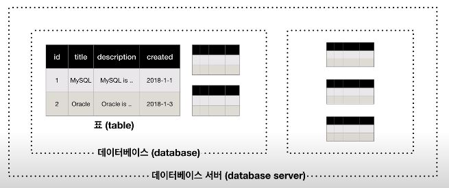

# MySQL이란

## MySQL 설치 과정
- https://www.mysql.com/products/community/ 에서 자신의 OS에 맞는 버젼으로 설치가능.
- https://bitnami.com/stack/wamp 에서 더 간편하게 설치 가능.
- 설치과정에서 비밀번호를 만들게 되는데 해당 비밀번호는 실행시에 사용하게됨

## MySQL 실행 과정
1) cmd창 열기
2) cd 명령어를 통해 C:\Bitnami\wampstack-7.4.10-0\mysql\bin로 이동 (설치한 버젼에 맞게)
3) mysql -uroot -p로 프로그램 실행. 후에 설치시 입력한 비밀번호 입력
> ### -u[username] -p
> - -u는 유저을 의미한다. username으로 접근한다. username이 root인 경우 root권한으로 접근
> - -p는 해당 username에 비밀번호가 설정되어있지 않은 경우에는 생략해도 된다. 그러나 비밀번호가 설정되어 있는데 생략하게되면 에러발생.
4) 완료

## 데이터 베이스 기본 구조

- 표 : 기본적인 데이터들을 기준에 따라 나열한 것.
- 데이터베이스 or 스키마 : 서로 연관된 데이터들을 그룹핑하여 만든 표들로 구성된 일종의 파일의 폴더개념 
- 데이터베이스 서버 : 데이터베이스들을 관리함. 
## MySQL 문법 정리
### 데이터베이스 관리
> #### CREATE DATABASE [databaseName];
> - databaseName으로 데이터베이스 생성
> #### DROP DATABASE [databaseName];
> - databaseName의 데이터베이스 삭제
> #### SHOW (DATABASES | SCHEMAS);
> - 데이터베이스 내용 출력
> #### USE [databaseName];
> - MySQL에게 내가 접근할 데이터베이스가 무엇인지 알려줌. 이를 통해 내가 업데이트하고자하는 데이터베이스에 접근가능
